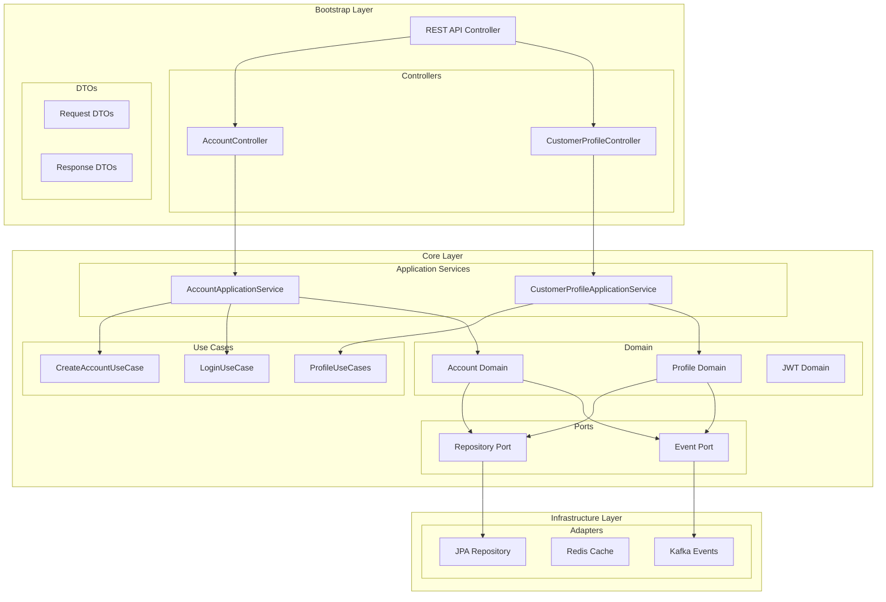

# 커머스 마이크로서비스 - 고객/인증 서비스


## 📋 프로젝트 개요

이 프로젝트는 이커머스 플랫폼을 위한 고객 도메인 마이크로서비스입니다. 헥사고날 아키텍처와 DDD(Domain-Driven Design)를 기반으로 하는 4계층 아키텍처로 설계되었습니다.

### 🛠 기술 스택

- **언어**: Java 17
- **프레임워크**: Spring Boot 3.2.0, Spring Cloud 2023.0.0
- **빌드 도구**: Gradle 8.5
- **테스트**: JUnit 5, Mockito, AssertJ
- **보안**: Spring Security, JWT (jsonwebtoken)
- **데이터베이스**: H2 (개발), PostgreSQL (운영)
- **캐싱**: Redis
- **메시징**: Kafka

## 🏗 아키텍처

### 4계층 아키텍처

```
├── bootstrap/          # 애플리케이션 진입점 (API 서버)
│   └── customer-api/   # 고객 서비스 REST API
├── core/              # 도메인 핵심 로직
│   └── customer-core/ # 고객 도메인 모델 & 비즈니스 로직
├── infrastructure/    # 외부 의존성 구현
│   └── persistence/   # 데이터 영속성 계층
└── common/           # 공통 모듈
```

### 헥사고날 아키텍처 (포트와 어댑터)



### 의존성 규칙

- ✅ Bootstrap → Core, Infrastructure, Common
- ✅ Infrastructure → Core, Common  
- ✅ Core → Common
- ❌ Core 모듈 간 직접 의존 금지
- ❌ Common → 다른 모듈 의존 금지

### 도메인 모델 구조

```mermaid
classDiagram
    class CustomerProfile {
        +ProfileId profileId
        +CustomerId customerId
        +PersonalInfo personalInfo
        +ContactInfo contactInfo
        +List~Address~ addresses
        +ProfilePreferences preferences
        +ProfileStatus status
        +updatePersonalInfo()
        +addAddress()
        +setDefaultAddress()
        +updatePreferences()
    }
    
    class PersonalInfo {
        +FullName fullName
        +BirthDate birthDate
        +Gender gender
        +ProfileImage profileImage
        +updateName()
        +updateBirthDate()
    }
    
    class ContactInfo {
        +PhoneNumber primaryPhone
        +PhoneNumber secondaryPhone
        +updatePrimaryPhone()
        +updateSecondaryPhone()
    }
    
    class Address {
        +AddressId addressId
        +AddressType type
        +String alias
        +String zipCode
        +String roadAddress
        +String jibunAddress
        +String detailAddress
        +updateAlias()
        +setAsDefault()
    }
    
    class ProfilePreferences {
        +MarketingConsent marketingConsent
        +NotificationSettings notificationSettings
        +List~CategoryInterest~ categoryInterests
        +List~BrandPreference~ brandPreferences
    }
    
    CustomerProfile ||--|| PersonalInfo
    CustomerProfile ||--|| ContactInfo
    CustomerProfile ||--o{ Address
    CustomerProfile ||--|| ProfilePreferences
```

## 📂 프로젝트 구조

```
msa_ecommerce_customer/
├── bootstrap/                  # 애플리케이션 진입점
│   └── customer-api/          # 고객 서비스 REST API
│       ├── src/main/java/com/commerce/customer/api/
│       │   ├── controller/    # REST API 컨트롤러
│       │   ├── dto/          # 요청/응답 DTO
│       │   ├── config/       # 설정 (Swagger, 보안)
│       │   └── exception/    # 예외 처리
│       ├── src/main/resources/
│       │   ├── application.yml
│       │   └── application-dev.yml
│       └── build.gradle
├── core/                       # 핵심 비즈니스 로직
│   └── customer-core/          # 고객 도메인 
│       ├── src/main/java/com/commerce/customer/core/
│       │   ├── application/    # 애플리케이션 서비스
│       │   │   ├── service/   # 애플리케이션 서비스 구현체
│       │   │   └── usecase/   # 유스케이스 인터페이스
│       │   ├── domain/         # 도메인 모델
│       │   │   ├── event/      # 도메인 이벤트
│       │   │   ├── exception/  # 도메인 예외
│       │   │   ├── model/      # 도메인 엔티티/값객체
│       │   │   ├── repository/ # 리포지토리 인터페이스
│       │   │   └── service/    # 도메인 서비스
│       │   └── usecase/        # 유스케이스 (향후 확장)
│       └── build.gradle
├── infrastructure/             # 인프라스트럭처 계층
│   └── persistence/            # 데이터 영속성
│       ├── src/main/java/com/commerce/infrastructure/persistence/
│       │   ├── common/         # 공통 엔티티
│       │   ├── config/         # JPA, QueryDSL, Redis 설정
│       │   ├── customer/       # 고객 관련 영속성
│       │   │   ├── adapter/    # 리포지토리 어댑터
│       │   │   ├── entity/     # JPA 엔티티
│       │   │   ├── mapper/     # 도메인 ↔ 엔티티 매핑
│       │   │   └── repository/ # JPA 리포지토리
│       │   └── security/       # 보안 설정
│       └── build.gradle
├── common/                     # 공통 모듈
│   └── build.gradle
├── docs/                       # 문서
│   ├── customer-core-architecture.md
│   ├── customer-profile-design.md
│   └── prd/                    # 제품 요구사항 문서
├── build.gradle               # 루트 빌드 스크립트
├── settings.gradle            # 프로젝트 설정
└── CLAUDE.md                  # 프로젝트 메모리
```

## 🎯 주요 기능

### 현재 구현된 기능

#### 🌐 REST API 서비스 (customer-api)
- **계정 관리 API**: 회원가입, 로그인, 로그아웃, 토큰 갱신
- **프로필 관리 API**: 고객 프로필 CRUD, 주소 관리
- **API 문서화**: Swagger/OpenAPI 3.0 기반 API 문서
- **예외 처리**: 글로벌 예외 핸들러와 표준화된 에러 응답
- **입력 검증**: Bean Validation 기반 요청 데이터 검증

#### 🏛️ 고객 도메인 (customer-core)
- **계정 관리**: 고객 계정 생성, 활성화, 상태 관리
- **인증/인가**: JWT 기반 토큰 인증 시스템
- **프로필 관리**: 개인정보, 주소, 연락처, 선호도 관리
- **애플리케이션 서비스**: 비즈니스 로직 조합 및 트랜잭션 관리
- **유스케이스**: 명확한 비즈니스 경계 정의
- **보안**: 비밀번호 암호화, 토큰 만료 관리
- **도메인 이벤트**: 계정 생성, 활성화, 로그인 성공 등

#### 🔌 API 엔드포인트

**계정 관리 API (`/api/v1/accounts`)**
- `POST /` - 계정 생성
- `POST /login` - 로그인
- `POST /logout` - 로그아웃
- `POST /refresh` - 토큰 갱신
- `GET /me` - 계정 정보 조회

**프로필 관리 API (`/api/v1/profiles`)**
- `POST /` - 프로필 생성
- `GET /me` - 현재 사용자 프로필 조회
- `GET /{profileId}` - 특정 프로필 조회
- `POST /{profileId}/addresses` - 주소 추가
- `PUT /{profileId}/addresses/{addressId}` - 주소 수정

#### 🏗️ 주요 도메인 객체

**계정 관리**
- `Account`: 고객 계정 엔티티
- `Email`, `Password`: 값 객체
- `JwtToken`, `TokenPair`: JWT 토큰 관리
- `AccountStatus`: 계정 상태 열거형

**프로필 관리**
- `CustomerProfile`: 고객 프로필 애그리게이트 루트
- `PersonalInfo`: 개인정보 (이름, 생년월일, 성별 등)
- `ContactInfo`: 연락처 정보 (주/보조 전화번호)
- `Address`: 주소 정보 (도로명/지번 주소, 배송 메모)
- `ProfilePreferences`: 프로필 설정 및 선호도
- `MarketingConsent`: 마케팅 수신 동의 관리
- `NotificationSettings`: 알림 설정 관리

**애플리케이션 서비스**
- `AccountApplicationService`: 계정 관련 비즈니스 플로우
- `CustomerProfileApplicationService`: 프로필 관련 비즈니스 플로우

#### 도메인 이벤트
- `AccountCreatedEvent`: 계정 생성 이벤트
- `AccountActivatedEvent`: 계정 활성화 이벤트
- `LoginSuccessfulEvent`: 로그인 성공 이벤트
- `TokenGeneratedEvent`: 토큰 생성 이벤트

### 계획된 기능 (PRD 기반)

1. ✅ **고객 프로필 관리**: 개인정보, 주소, 연락처 관리 (완료)
2. ✅ **Customer Service API**: REST API 엔드포인트 구현 (완료)
3. **고객 활동 추적**: 로그인 기록, 페이지 뷰, 구매 패턴
4. **고객 세분화**: RFM 분석, 행동 기반 세분화
5. **고객 라이프사이클 관리**: 온보딩, 유지, 이탈 관리
6. **고객 소통 관리**: 알림, 메시지, 피드백 시스템

## 🚀 시작하기

### 전제 조건

- Java 17 이상
- Gradle 8.5 이상

### 빌드 및 실행

```bash
# 전체 빌드
./gradlew build

# 특정 모듈 빌드
./gradlew :customer-core:build
./gradlew :customer-api:build

# API 서버 실행
./gradlew :customer-api:bootRun

# 테스트 실행
./gradlew test

# 클린 빌드
./gradlew clean build
```

### API 서버 접속

```bash
# 개발 환경
http://localhost:8080

# Swagger UI
http://localhost:8080/swagger-ui.html

# API 문서
http://localhost:8080/api-docs
```

### 테스트

```bash
# 전체 테스트
./gradlew test

# 특정 모듈 테스트
./gradlew :customer-core:test

# 테스트 커버리지 확인
./gradlew jacocoTestReport
```

## 📝 개발 가이드

### 코딩 규칙

1. **Lombok 사용**: 모든 엔티티/값객체에 `@Getter` 적용
2. **불변 객체**: 값 객체는 불변으로 설계
3. **유효성 검증**: 생성자에서 비즈니스 규칙 검증
4. **도메인 이벤트**: 중요한 상태 변경 시 이벤트 발행
5. **패키지 구조**: domain, application, usecase로 명확히 분리

### 테스트 코드 규칙

- Given-When-Then 패턴 적용
- 예외 상황 테스트 포함
- `@DisplayName` 사용하여 테스트 가독성 향상
- Parameterized Tests 적절히 활용

### 커밋 규칙

- push 하기 전에 수정된 모듈의 테스트 코드가 모두 통과해야 함
- 테스트 커버리지 70% 이상 유지 (현재: 72%)

### 테스트 현황

- **전체 테스트 수**: 200+ 테스트
- **테스트 커버리지**: 72%
- **프로필 도메인 커버리지**: 83%
- **주요 개선 사항**:
  - MarketingConsent: 98% 커버리지
  - NotificationSettings: 97% 커버리지
  - BrandPreference: 100% 커버리지
  - 도메인 이벤트 테스트 추가

## 🔧 설정

### 환경별 설정 파일

- `application.yml`: 기본 설정
- `application-dev.yml`: 개발 환경
- `application-test.yml`: 테스트 환경  
- `application-prod.yml`: 운영 환경

### JaCoCo 테스트 커버리지

- 최소 커버리지: 80%
- 리포트 형식: XML, HTML

## 📋 향후 계획

### 예정된 인프라스트럭처

1. **messaging**: Kafka 메시징
2. **external**: 외부 API 연동
3. **cache**: Redis 캐싱

### 예정된 Bootstrap 모듈

1. ✅ **customer-api**: 고객 서비스 API (완료)
2. **api-gateway**: API 게이트웨이 서비스

## 📄 라이선스

이 프로젝트는 MIT 라이선스를 따릅니다.

## 🤝 기여하기

1. 이슈를 먼저 등록해 주세요
2. 브랜치를 생성하여 작업해 주세요
3. 테스트 코드를 작성해 주세요
4. Pull Request를 생성해 주세요

## 📞 문의

프로젝트 관련 문의사항이 있으시면 이슈를 등록해 주세요.