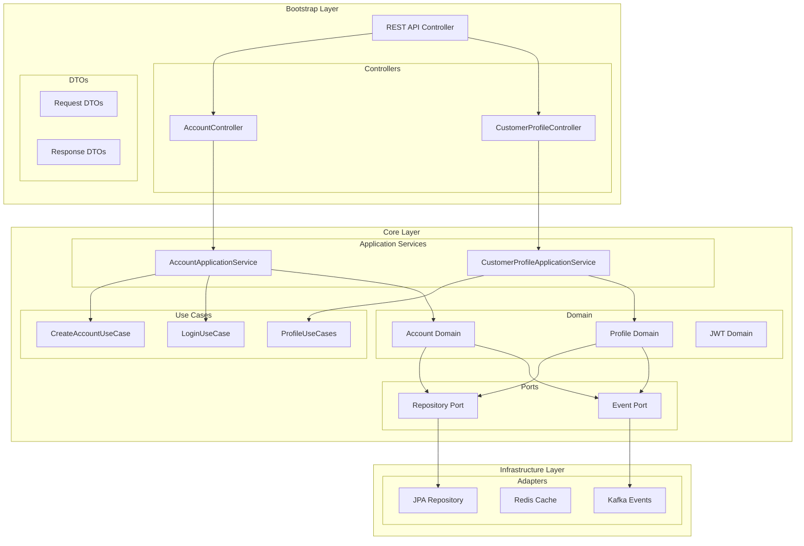
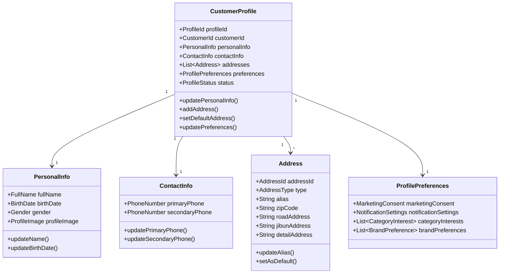

# 커머스 마이크로서비스 아키텍처 개요

## 🏗 아키텍처

### 4계층 아키텍처

```
├── bootstrap/          # 애플리케이션 진입점 (API 서버)
│   └── customer-api/   # 고객 서비스 REST API
├── core/              # 도메인 핵심 로직
│   └── customer-core/ # 고객 도메인 모델 & 비즈니스 로직
├── infrastructure/    # 외부 의존성 구현
│   └── persistence/   # 데이터 영속성 계층
└── common/           # 공통 모듈
```

### 헥사고날 아키텍처 (포트와 어댑터)



### 의존성 규칙

- ✅ Bootstrap → Core, Infrastructure, Common
- ✅ Infrastructure → Core, Common  
- ✅ Core → Common
- ❌ Core 모듈 간 직접 의존 금지
- ❌ Common → 다른 모듈 의존 금지

### 도메인 모델 구조



## 📂 프로젝트 구조

```
msa_ecommerce_customer/
├── bootstrap/                  # 애플리케이션 진입점
│   └── customer-api/          # 고객 서비스 REST API
│       ├── src/main/java/com/commerce/customer/api/
│       │   ├── controller/    # REST API 컨트롤러
│       │   ├── dto/          # 요청/응답 DTO
│       │   ├── config/       # 설정 (Swagger, 보안)
│       │   └── exception/    # 예외 처리
│       ├── src/main/resources/
│       │   ├── application.yml
│       │   └── application-dev.yml
│       └── build.gradle
├── core/                       # 핵심 비즈니스 로직
│   └── customer-core/          # 고객 도메인 
│       ├── src/main/java/com/commerce/customer/core/
│       │   ├── application/    # 애플리케이션 서비스
│       │   │   ├── service/   # 애플리케이션 서비스 구현체
│       │   │   └── usecase/   # 유스케이스 인터페이스
│       │   ├── domain/         # 도메인 모델
│       │   │   ├── event/      # 도메인 이벤트
│       │   │   ├── exception/  # 도메인 예외
│       │   │   ├── model/      # 도메인 엔티티/값객체
│       │   │   ├── repository/ # 리포지토리 인터페이스
│       │   │   └── service/    # 도메인 서비스
│       │   └── usecase/        # 유스케이스 (향후 확장)
│       └── build.gradle
├── infrastructure/             # 인프라스트럭처 계층
│   └── persistence/            # 데이터 영속성
│       ├── src/main/java/com/commerce/infrastructure/persistence/
│       │   ├── common/         # 공통 엔티티
│       │   ├── config/         # JPA, QueryDSL, Redis 설정
│       │   ├── customer/       # 고객 관련 영속성
│       │   │   ├── adapter/    # 리포지토리 어댑터
│       │   │   ├── entity/     # JPA 엔티티
│       │   │   ├── mapper/     # 도메인 ↔ 엔티티 매핑
│       │   │   └── repository/ # JPA 리포지토리
│       │   └── security/       # 보안 설정
│       └── build.gradle
├── common/                     # 공통 모듈
│   └── build.gradle
├── docs/                       # 문서
│   ├── architecture-overview.md  # 아키텍처 개요 (이 문서)
│   ├── customer-api-architecture.md
│   ├── customer-core-architecture.md
│   ├── customer-profile-design.md
│   └── prd/                    # 제품 요구사항 문서
├── build.gradle               # 루트 빌드 스크립트
├── settings.gradle            # 프로젝트 설정
└── CLAUDE.md                  # 프로젝트 메모리
```

### 🏗️ 주요 도메인 객체

**계정 관리**
- `Account`: 고객 계정 엔티티
- `Email`, `Password`: 값 객체
- `JwtToken`, `TokenPair`: JWT 토큰 관리
- `AccountStatus`: 계정 상태 열거형

**프로필 관리**
- `CustomerProfile`: 고객 프로필 애그리게이트 루트
- `PersonalInfo`: 개인정보 (이름, 생년월일, 성별 등)
- `ContactInfo`: 연락처 정보 (주/보조 전화번호)
- `Address`: 주소 정보 (도로명/지번 주소, 배송 메모)
- `ProfilePreferences`: 프로필 설정 및 선호도
- `MarketingConsent`: 마케팅 수신 동의 관리
- `NotificationSettings`: 알림 설정 관리

**애플리케이션 서비스**
- `AccountApplicationService`: 계정 관련 비즈니스 플로우
- `CustomerProfileApplicationService`: 프로필 관련 비즈니스 플로우

### 도메인 이벤트
- `AccountCreatedEvent`: 계정 생성 이벤트
- `AccountActivatedEvent`: 계정 활성화 이벤트
- `LoginSuccessfulEvent`: 로그인 성공 이벤트
- `TokenGeneratedEvent`: 토큰 생성 이벤트