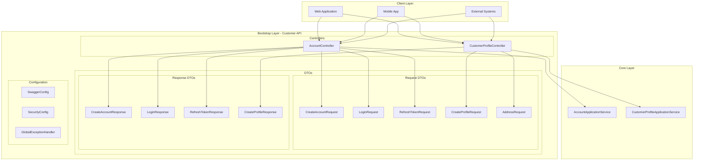
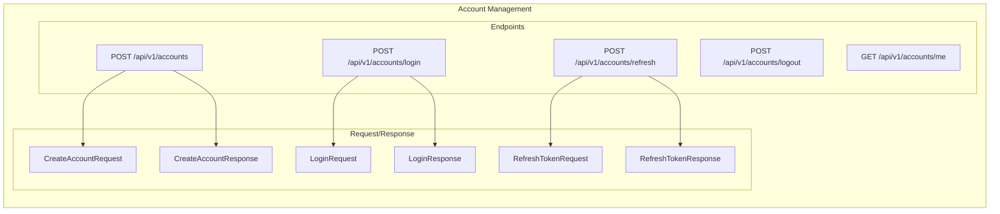
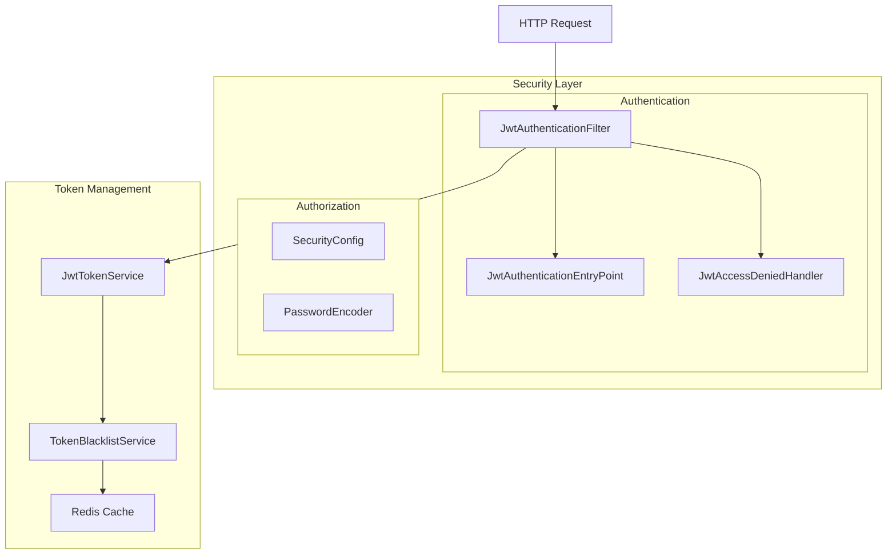
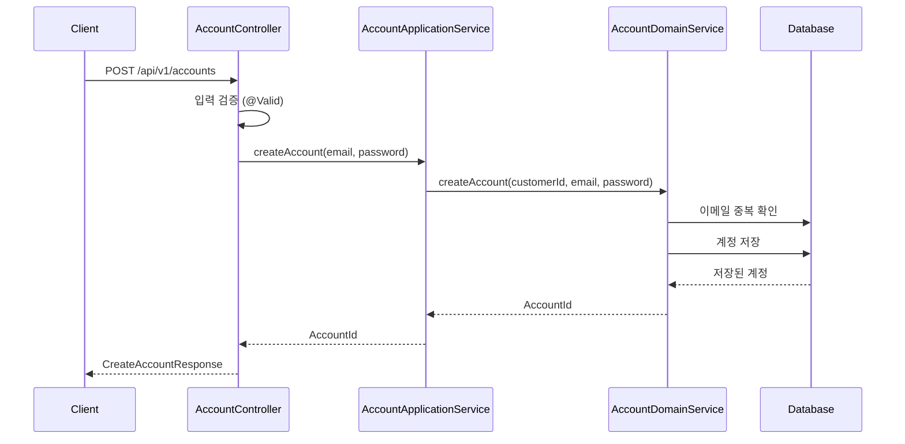
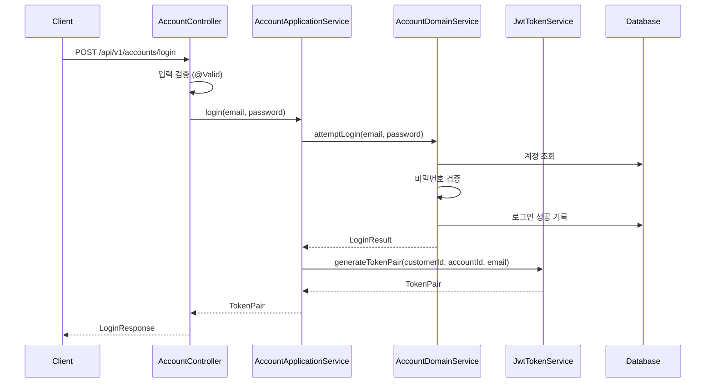
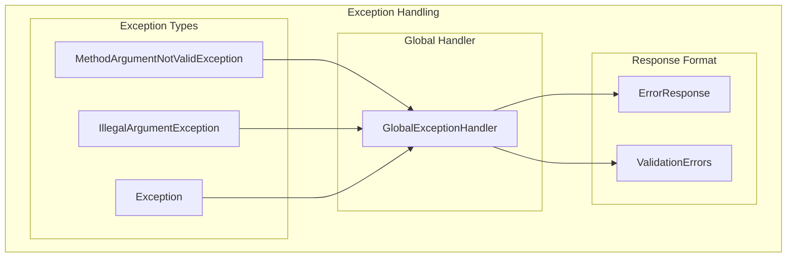

# Customer API 아키텍처

## 개요

Customer API는 커머스 시스템의 고객 관리 및 인증을 위한 REST API 서비스입니다. 헥사고날 아키텍처의 Bootstrap 계층으로서, 외부 클라이언트와 Core 도메인 사이의 인터페이스 역할을 담당합니다.

## 아키텍처 개요



## API 엔드포인트 상세

### 계정 관리 API



**계정 생성 (POST /api/v1/accounts)**
```json
{
  "email": "user@example.com",
  "password": "securePassword123!"
}
```

**로그인 (POST /api/v1/accounts/login)**
```json
{
  "email": "user@example.com",
  "password": "securePassword123!"
}
```

**응답 예시**
```json
{
  "accessToken": "eyJhbGciOiJIUzI1NiIsInR5cCI6IkpXVCJ9...",
  "refreshToken": "eyJhbGciOiJIUzI1NiIsInR5cCI6IkpXVCJ9...",
  "accountId": 12345,
  "email": "user@example.com"
}
```

### 프로필 관리 API

```mermaid
graph LR
    subgraph "Profile Management"
        subgraph "Endpoints"
            CREATE_PROFILE[POST /api/v1/profiles]
            GET_MY_PROFILE[GET /api/v1/profiles/me]
            GET_PROFILE[GET /api/v1/profiles/{id}]
            ADD_ADDRESS[POST /api/v1/profiles/{id}/addresses]
            UPDATE_ADDRESS[PUT /api/v1/profiles/{id}/addresses/{addressId}]
        end
        
        subgraph "Request/Response"
            PROFILE_REQ[CreateProfileRequest]
            ADDRESS_REQ[AddressRequest]
            PROFILE_RES[CreateProfileResponse]
        end
    end
    
    CREATE_PROFILE --> PROFILE_REQ
    CREATE_PROFILE --> PROFILE_RES
    ADD_ADDRESS --> ADDRESS_REQ
    UPDATE_ADDRESS --> ADDRESS_REQ
```

**프로필 생성 (POST /api/v1/profiles)**
```json
{
  "firstName": "홍",
  "lastName": "길동",
  "birthDate": "1990-01-01",
  "gender": "MALE",
  "phoneNumber": "010-1234-5678"
}
```

**주소 추가 (POST /api/v1/profiles/{id}/addresses)**
```json
{
  "type": "HOME",
  "roadAddress": "서울특별시 강남구 테헤란로 123",
  "jibunAddress": "서울특별시 강남구 역삼동 123-45",
  "detailAddress": "ABC빌딩 12층",
  "zipCode": "12345",
  "isDefault": true
}
```

## 보안 아키텍처



## 요청/응답 플로우

### 계정 생성 플로우



### 로그인 플로우



## 예외 처리 아키텍처



**에러 응답 형식**
```json
{
  "code": "INVALID_ARGUMENT",
  "message": "이메일은 필수입니다."
}
```

**유효성 검증 에러**
```json
{
  "email": "유효한 이메일 형식이어야 합니다.",
  "password": "비밀번호는 8자 이상 20자 이하여야 합니다."
}
```

## 입력 검증 아키텍처

```mermaid
graph LR
    subgraph "Validation Layer"
        subgraph "Bean Validation"
            NOTNULL[@NotNull]
            NOTBLANK[@NotBlank]
            EMAIL[@Email]
            SIZE[@Size]
            PATTERN[@Pattern]
        end
        
        subgraph "Custom Validation"
            CUSTOM_VALIDATOR[Custom Validators]
        end
    end
    
    subgraph "DTO Classes"
        CREATE_ACCOUNT_REQ[CreateAccountRequest]
        LOGIN_REQ[LoginRequest]
        CREATE_PROFILE_REQ[CreateProfileRequest]
        ADDRESS_REQ[AddressRequest]
    end
    
    CREATE_ACCOUNT_REQ --> EMAIL
    CREATE_ACCOUNT_REQ --> NOTBLANK
    CREATE_ACCOUNT_REQ --> SIZE
    
    LOGIN_REQ --> EMAIL
    LOGIN_REQ --> NOTBLANK
    
    CREATE_PROFILE_REQ --> NOTBLANK
    CREATE_PROFILE_REQ --> PATTERN
    
    ADDRESS_REQ --> PATTERN
    ADDRESS_REQ --> NOTBLANK
```

## API 문서화

```mermaid
graph LR
    subgraph "API Documentation"
        subgraph "Swagger Configuration"
            SWAGGER_CONFIG[SwaggerConfig]
            OPENAPI_CONFIG[OpenAPI Configuration]
        end
        
        subgraph "Annotations"
            TAG[@Tag]
            OPERATION[@Operation]
            PARAMETER[@Parameter]
            RESPONSE[@ApiResponse]
        end
        
        subgraph "Generated Documentation"
            SWAGGER_UI[Swagger UI]
            API_DOCS[API Documentation]
        end
    end
    
    SWAGGER_CONFIG --> OPENAPI_CONFIG
    OPENAPI_CONFIG --> SWAGGER_UI
    OPENAPI_CONFIG --> API_DOCS
    
    TAG --> SWAGGER_UI
    OPERATION --> SWAGGER_UI
    PARAMETER --> SWAGGER_UI
    RESPONSE --> SWAGGER_UI
```

## 주요 설계 원칙

### 1. 관심사의 분리
- 컨트롤러: HTTP 요청/응답 처리
- DTO: 데이터 전송 객체
- 애플리케이션 서비스: 비즈니스 로직 호출

### 2. 입력 검증
- Bean Validation 사용
- 도메인 모델 진입 전 검증
- 명확한 에러 메시지 제공

### 3. 표준화된 응답
- 일관된 응답 형식
- HTTP 상태 코드 적절히 사용
- 에러 응답 표준화

### 4. 보안
- JWT 기반 인증
- 토큰 블랙리스트 관리
- 적절한 CORS 설정

### 5. 문서화
- OpenAPI 3.0 스펙 준수
- 실시간 API 문서 생성
- 예시 요청/응답 제공

## 성능 고려사항

### 1. 캐싱
- Redis 기반 토큰 캐싱
- 세션 정보 캐싱

### 2. 데이터베이스 최적화
- 적절한 인덱스 설정
- 쿼리 최적화
- 연결 풀 관리

### 3. 비동기 처리
- 도메인 이벤트 비동기 처리
- 메시징 시스템 연동

## 향후 확장 계획

1. **API 버전 관리**: URI 또는 헤더 기반 버전 관리
2. **레이트 리미팅**: API 호출 제한 기능
3. **API 모니터링**: 메트릭 수집 및 대시보드
4. **다국어 지원**: 다국어 메시지 및 에러 응답
5. **API 테스트**: 통합 테스트 및 계약 테스트