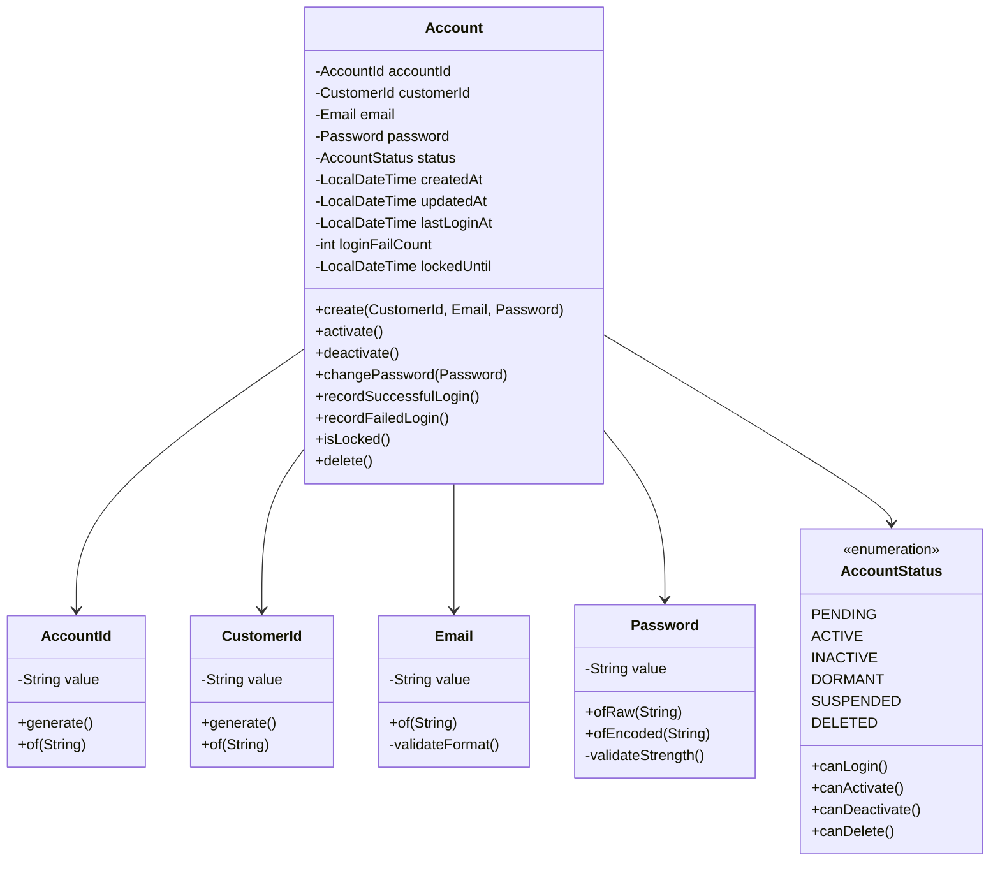
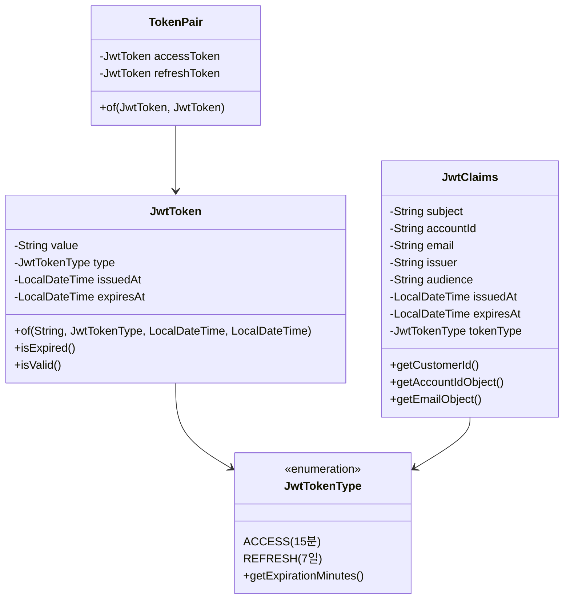
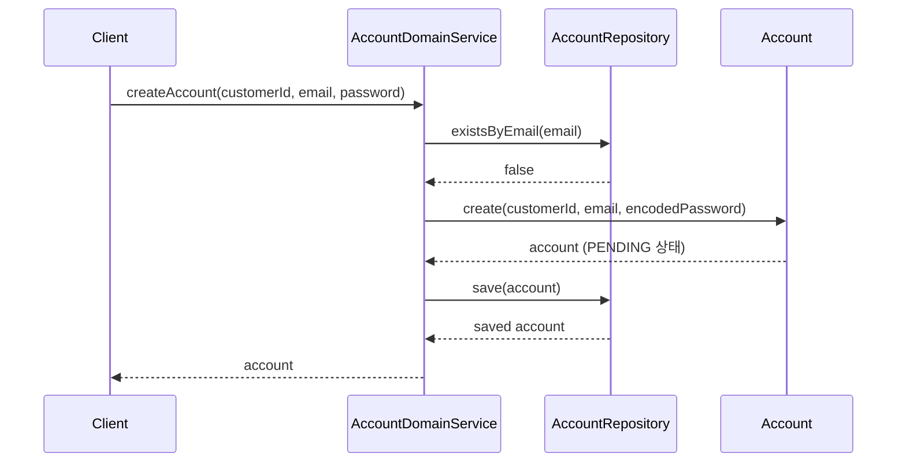
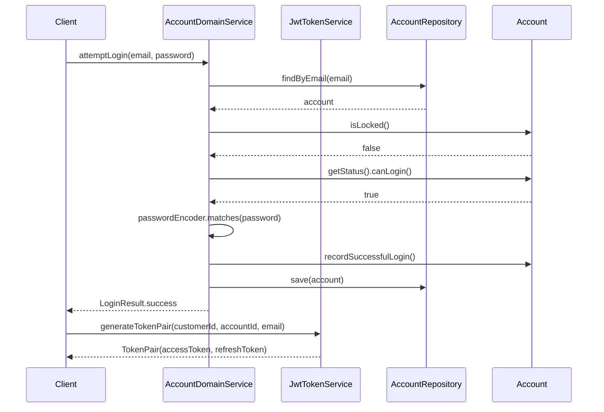
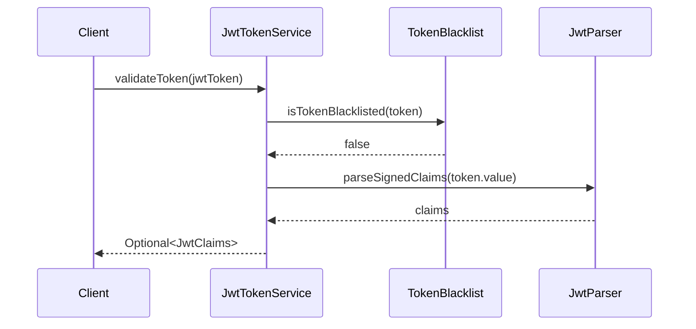
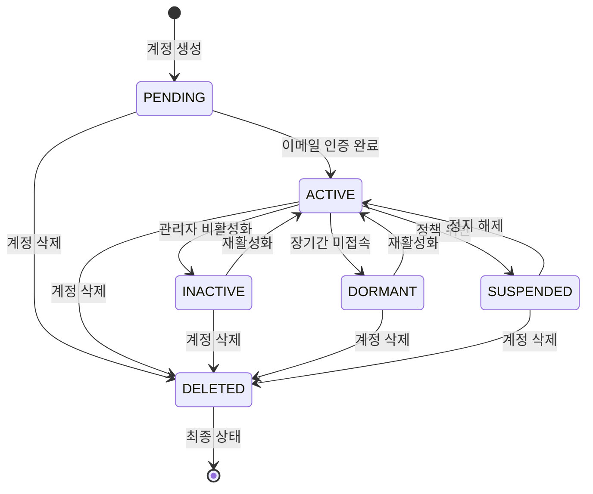
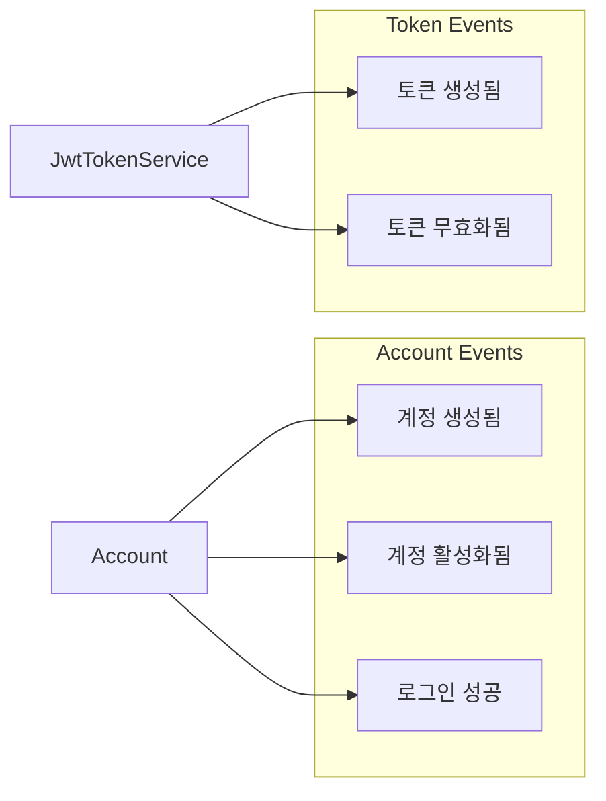
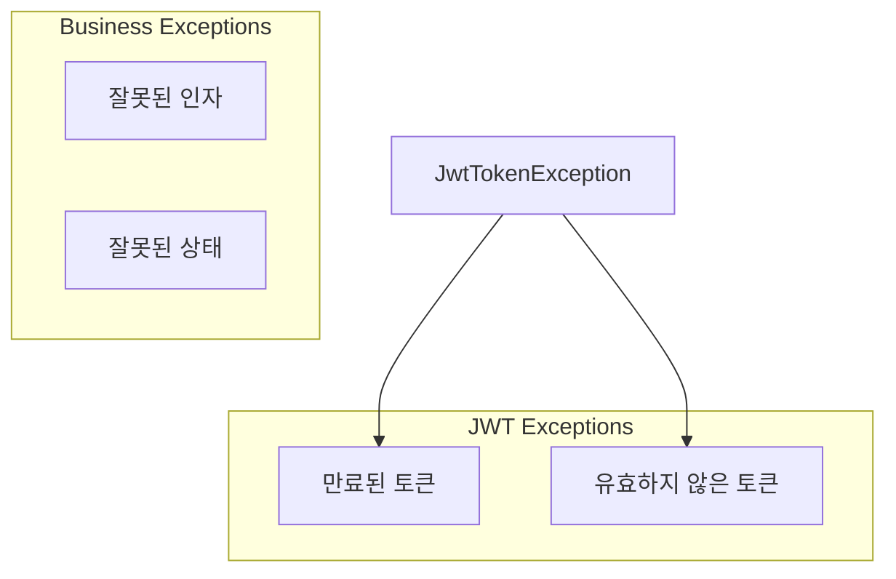

# Customer Core 모듈 아키텍처

## 개요

Customer Core 모듈은 커머스 시스템의 고객 관리 및 인증을 담당하는 핵심 도메인 모듈입니다. 헥사고날 아키텍처와 DDD(Domain-Driven Design) 원칙을 따라 설계되었습니다.

## 아키텍처 개요

```mermaid
graph TB
    subgraph "Customer Core Module"
        subgraph "Application Layer"
            subgraph "Services"
                ACCOUNT_APP[AccountApplicationService]
                PROFILE_APP[CustomerProfileApplicationService]
            end
            subgraph "Use Cases"
                UC_CREATE[CreateAccountUseCase]
                UC_LOGIN[LoginUseCase]
                UC_LOGOUT[LogoutUseCase]
                UC_REFRESH[RefreshTokenUseCase]
                UC_PROFILE_CREATE[CreateCustomerProfileUseCase]
                UC_PROFILE_GET[GetCustomerProfileUseCase]
                UC_PROFILE_UPDATE[UpdateCustomerProfileUseCase]
            end
        end
        
        subgraph "Domain Layer"
            subgraph "Models"
                Account[Account]
                AccountId[AccountId]
                CustomerId[CustomerId]
                Email[Email]
                Password[Password]
                AccountStatus[AccountStatus]
                
                subgraph "JWT Models"
                    JwtToken[JwtToken]
                    JwtClaims[JwtClaims]
                    JwtTokenType[JwtTokenType]
                    TokenPair[TokenPair]
                end
            end
            
            subgraph "Services"
                AccountDomainService[AccountDomainService]
                JwtTokenService[JwtTokenService]
                JwtTokenServiceImpl[JwtTokenServiceImpl]
            end
            
            subgraph "Repositories"
                AccountRepository[AccountRepository]
            end
            
            subgraph "Events"
                AccountCreatedEvent[AccountCreatedEvent]
                AccountActivatedEvent[AccountActivatedEvent]
                LoginSuccessfulEvent[LoginSuccessfulEvent]
                TokenGeneratedEvent[TokenGeneratedEvent]
                TokenInvalidatedEvent[TokenInvalidatedEvent]
            end
            
            subgraph "Exceptions"
                JwtTokenException[JwtTokenException]
                ExpiredJwtTokenException[ExpiredJwtTokenException]
                InvalidJwtTokenException[InvalidJwtTokenException]
            end
        end
    end
    
    Account --> AccountId
    Account --> CustomerId
    Account --> Email
    Account --> Password
    Account --> AccountStatus
    
    AccountDomainService --> Account
    AccountDomainService --> AccountRepository
    AccountDomainService -.-> Events
    
    JwtTokenServiceImpl --> JwtToken
    JwtTokenServiceImpl --> JwtClaims
    JwtTokenServiceImpl --> TokenPair
    JwtTokenServiceImpl -.-> Exceptions
    
    ACCOUNT_APP --> UC_CREATE
    ACCOUNT_APP --> UC_LOGIN
    ACCOUNT_APP --> UC_LOGOUT
    ACCOUNT_APP --> UC_REFRESH
    PROFILE_APP --> UC_PROFILE_CREATE
    PROFILE_APP --> UC_PROFILE_GET
    PROFILE_APP --> UC_PROFILE_UPDATE
    
    ACCOUNT_APP --> AccountDomainService
    ACCOUNT_APP --> JwtTokenService
    PROFILE_APP --> CustomerProfileDomainService
```

## 도메인 모델 상세

### 핵심 엔티티

### JWT 토큰 모델

## 서비스 레이어

```mermaid
graph TD
    subgraph "Domain Services"
        AccountDomainService --> AccountRepository
        AccountDomainService --> PasswordEncoder
        
        JwtTokenServiceImpl --> JwtParser
        JwtTokenServiceImpl --> SecretKey
        JwtTokenServiceImpl --> TokenBlacklist
    end
    
    subgraph "Service Operations"
        CreateAccount[계정 생성]
        Login[로그인 시도]
        ChangePassword[비밀번호 변경]
        ActivateAccount[계정 활성화]
        
        GenerateTokenPair[토큰 쌍 생성]
        RefreshToken[토큰 갱신]
        ValidateToken[토큰 검증]
        InvalidateToken[토큰 무효화]
    end
    
    AccountDomainService --> CreateAccount
    AccountDomainService --> Login
    AccountDomainService --> ChangePassword
    AccountDomainService --> ActivateAccount
    
    JwtTokenServiceImpl --> GenerateTokenPair
    JwtTokenServiceImpl --> RefreshToken
    JwtTokenServiceImpl --> ValidateToken
    JwtTokenServiceImpl --> InvalidateToken
```

## 비즈니스 플로우

### 계정 생성 플로우

### 로그인 플로우

### 토큰 검증 플로우

## 계정 상태 전이도

## 도메인 이벤트

## 예외 처리

## 주요 설계 원칙

### 1. 도메인 모델의 불변성
- 모든 값 객체(Value Object)는 불변으로 설계
- 엔티티의 상태 변경은 도메인 메서드를 통해서만 가능

### 2. 비즈니스 규칙 캡슐화
- 계정 상태 전이 규칙을 AccountStatus enum에 캡슐화
- 비밀번호 강도 검증을 Password 값 객체에 캡슐화
- 이메일 형식 검증을 Email 값 객체에 캡슐화

### 3. 의존성 역전
- 도메인 서비스는 인터페이스를 통해 외부 의존성과 상호작용
- PasswordEncoder 인터페이스를 통한 암호화 서비스 추상화

### 4. 이벤트 기반 설계
- 도메인 이벤트를 통한 느슨한 결합
- 향후 이벤트 소싱 및 CQRS 패턴 적용 가능

### 5. 보안 고려사항
- JWT 토큰 블랙리스트 관리
- 로그인 실패 횟수 제한 및 계정 잠금
- 비밀번호 암호화 및 강도 검증

## 향후 확장 계획

1. **이벤트 발행 기능 완성**: 현재 주석 처리된 도메인 이벤트 발행 로직 구현
2. **소셜 로그인 지원**: OAuth2 제공자를 통한 로그인 기능 추가
3. **다중 인증 방식**: SMS, 이메일 OTP 등 추가 인증 방식 지원
4. **토큰 저장소 개선**: Redis 기반 토큰 블랙리스트 및 세션 관리
5. **감사 로그**: 계정 관련 모든 활동에 대한 감사 로그 기능