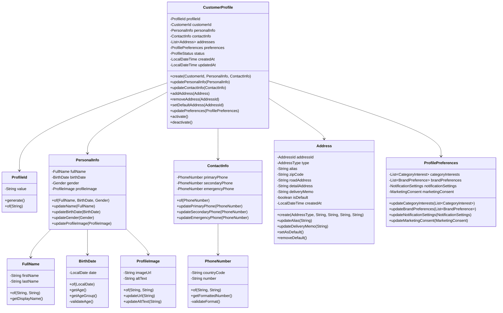
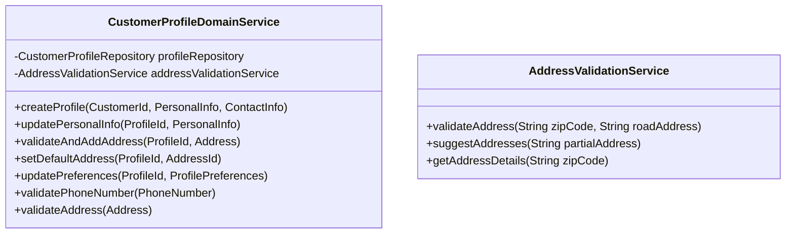
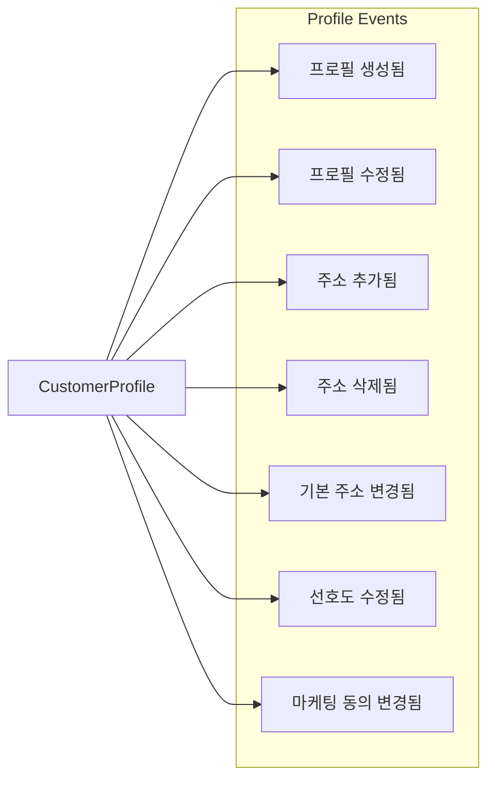
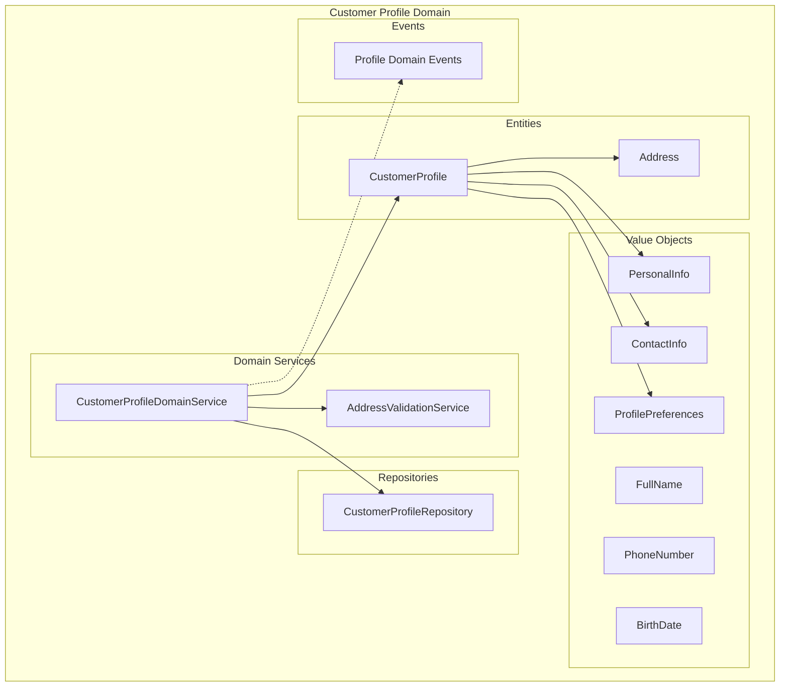

# Customer Profile Domain 설계 문서

## 개요

Customer Profile 도메인은 고객의 개인정보, 선호도, 주소 정보 등을 관리하는 핵심 도메인입니다. Account 도메인과 별도로 분리하여 관리하며, 고객의 프로필 변경이 계정 인증과 독립적으로 동작할 수 있도록 설계합니다.

## 도메인 모델 설계

### 핵심 엔티티 및 값 객체



### 열거형 및 값 객체

```mermaid
classDiagram
    class ProfileStatus {
        <<enumeration>>
        ACTIVE
        INACTIVE
        SUSPENDED
        +canUpdate()
        +canAddAddress()
    }
    
    class Gender {
        <<enumeration>>
        MALE
        FEMALE
        OTHER
        PREFER_NOT_TO_SAY
    }
    
    class AddressType {
        <<enumeration>>
        HOME
        WORK
        OTHER
    }
    
    class CategoryInterest {
        -String categoryId
        -String categoryName
        -InterestLevel level
        +of(String, String, InterestLevel)
    }
    
    class InterestLevel {
        <<enumeration>>
        LOW
        MEDIUM
        HIGH
        VERY_HIGH
    }
    
    class BrandPreference {
        -String brandId
        -String brandName
        -PreferenceLevel level
        +of(String, String, PreferenceLevel)
    }
    
    class PreferenceLevel {
        <<enumeration>>
        DISLIKE
        NEUTRAL
        LIKE
        LOVE
    }
    
    class NotificationSettings {
        -boolean emailNotification
        -boolean smsNotification
        -boolean pushNotification
        -boolean orderUpdates
        -boolean promotionalOffers
        +updateEmailNotification(boolean)
        +updateSmsNotification(boolean)
        +updatePushNotification(boolean)
        +updateOrderUpdates(boolean)
        +updatePromotionalOffers(boolean)
    }
    
    class MarketingConsent {
        -boolean emailMarketing
        -boolean smsMarketing
        -boolean personalizedAds
        -LocalDateTime consentDate
        -LocalDateTime lastUpdated
        +giveConsent(boolean, boolean, boolean)
        +revokeConsent()
        +updateEmailConsent(boolean)
        +updateSmsConsent(boolean)
        +updatePersonalizedAdsConsent(boolean)
    }
```



## 도메인 서비스



## 비즈니스 규칙

### 1. 프로필 생성 규칙
- CustomerProfile은 반드시 유효한 CustomerId와 연결되어야 함
- 최소한의 PersonalInfo(이름)와 ContactInfo(주 연락처)가 필요
- 생성 시 기본 상태는 ACTIVE

### 2. 주소 관리 규칙
- 고객당 최대 10개의 주소 등록 가능
- 반드시 하나의 기본 주소가 설정되어야 함
- 주소 삭제 시 기본 주소인 경우 다른 주소를 기본으로 설정해야 함
- 주소 검증은 외부 API를 통해 수행

### 3. 개인정보 수정 규칙
- 이름 변경은 특별한 인증 절차 필요 (향후 구현)
- 생년월일은 만 14세 이상이어야 함
- 연락처 변경 시 SMS 인증 필요 (향후 구현)

### 4. 선호도 관리 규칙
- 카테고리 관심도는 최대 20개까지 설정 가능
- 브랜드 선호도는 최대 50개까지 설정 가능
- 마케팅 동의는 언제든지 철회 가능

## 도메인 이벤트



## 아키텍처 다이어그램



## Use Cases

### 1. 프로필 생성
```
Given: 유효한 고객 ID와 기본 개인정보
When: 새 프로필을 생성할 때
Then: 프로필이 ACTIVE 상태로 생성되고 ProfileCreatedEvent가 발행됨
```

### 2. 주소 추가
```
Given: 활성 프로필과 유효한 주소 정보
When: 새 주소를 추가할 때
Then: 주소가 검증되고 추가되며 AddressAddedEvent가 발행됨
```

### 3. 기본 주소 변경
```
Given: 여러 개의 주소가 등록된 프로필
When: 기본 주소를 변경할 때
Then: 기존 기본 주소는 해제되고 새 주소가 기본으로 설정됨
```

### 4. 선호도 업데이트
```
Given: 활성 프로필
When: 카테고리 관심도나 브랜드 선호도를 업데이트할 때
Then: 선호도가 업데이트되고 PreferencesUpdatedEvent가 발행됨
```

## 제약 사항 및 비즈니스 규칙

1. **데이터 무결성**
   - ProfileId는 시스템 내에서 유일해야 함
   - CustomerId는 Account 도메인의 유효한 고객과 연결되어야 함

2. **비즈니스 제약**
   - 프로필당 최대 주소 개수: 10개
   - 프로필당 최대 카테고리 관심도: 20개
   - 프로필당 최대 브랜드 선호도: 50개

3. **보안 규칙**
   - 개인정보 변경 시 적절한 인증 필요
   - 민감한 정보는 암호화하여 저장

4. **유효성 검증**
   - 전화번호 형식 검증
   - 주소 실존 여부 검증
   - 생년월일 유효성 검증 (만 14세 이상)

## 확장 계획

1. **소셜 프로필 연동**: SNS 프로필 정보 동기화
2. **프로필 분석**: 고객 행동 패턴 분석 기능
3. **개인화 추천**: 프로필 기반 상품 추천
4. **프로필 백업**: 프로필 데이터 내보내기/가져오기 기능